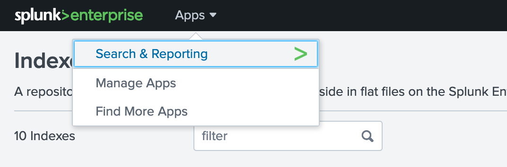

# Forwarding logs to an external logging platform

In this workshop we will explore how to forward logs to an external logging platform through the built in OpenShift Logging service. For this workshop, the logging platform that we will be forwarding to is Spunk, however, for workshop purposes this instance of Splunk will actually also be deployed on your OpenShift cluster.

### 1. Setup

1. Clone the repo

    ```bash
    git clone https://github.com/odrodrig/openshift-logforwarding-splunk.git
    cd openshift-logforwarding-splunk
    ```

1. In the `Cloud Shell`, download and unzip Helm v3.2.

    ```console
    cd $HOME
    wget https://get.helm.sh/helm-v3.2.0-linux-amd64.tar.gz
    tar -zxvf helm-v3.2.0-linux-amd64.tar.gz
    ```

1. Make Helm v3 CLI available in your `PATH` environment variable.

    ```console
    echo 'export PATH=$HOME/linux-amd64:$PATH' > $HOME/.bash_profile
    source $HOME/.bash_profile
    ```

1. Verify Helm v3 installation.

    ```console
    helm version --short
    ```

    outputs,

    ```console
    $ helm version --short
    v3.2.0+ge11b7ce
    ```

## 1. Deploy OpenShift Logging

In OpenShift with the OpenShift Logging operator you are able to create an instance of the EFK stack which includes Elasticsearch for storing logs, Fluentd for collecting logs, and Kibana for displaying logs. We will be exploring how to utilize the built-in EFK stack to gather logs and forward them to Splunk.

In order to forward the logs to Splunk we will need to forward the logs using Fluentd. While the EFK stack includes an instance of Fluentd already, we need to configure a standalone instance of Fluentd to act as our forwarding service to send logs to Splunk.
This process can be done through the OpenShift web console or through the cli. For the purposes of this workshop, we will be using yaml files with the cli to set everything up for us.

1. First we need to create projects for our OpenShift logging operator and for the Elasticsearch operator.

    ```bash
    oc apply -f prereqs/projects.yaml
    ```

1. Next, we will need to create the operators. This is done by creating an OperatorGroup and a subscription to both the Elasticsearch operator and the OpenShift Logging operator.

    ```bash
    oc apply -f prereqs/operators.yaml
    ```

1. Before we proceed we need to verify that the operators are deployed. This is done by looking at the ClusterServiceVersion that was deployed for the Operator when we created the subscriptions. Ensure that for both operators the `PHASE` column reads `Succeeded`. This will take a minute to complete. If you try too early you might see a message that says `No resources found in openshift-logging namespace.`

    ```bash
    oc get csv -n openshift-logging
    ```

    ```bash
    NAME                             DISPLAY                            VERSION    REPLACES   PHASE
    cluster-logging.5.2.2-21         Red Hat OpenShift Logging          5.2.2-21              Succeeded
    elasticsearch-operator.5.1.2-7   OpenShift Elasticsearch Operator   5.1.2-7               Succeeded
    ```

1. With the OpenShift Logging operator deployed we now need to create our ClusterLogging instance. Before we run the command to create it, let's take a look at the clusterLogging.yaml file:

    ```yaml
    apiVersion: "logging.openshift.io/v1"
    kind: "ClusterLogging"
    metadata:
    name: "instance" 
    namespace: "openshift-logging"
    spec:
    managementState: "Managed"
    # logStore:
    #   type: "elasticsearch"  
    #   retentionPolicy: 
    #     application:
    #       maxAge: 1d
    #     infra:
    #       maxAge: 7d
    #     audit:
    #       maxAge: 7d
    #   elasticsearch:
    #     nodeCount: 3 
    #     storage:
    #       storageClassName: "ibmc-block-gold" 
    #       size: 200G
    #     resources: 
    #       requests:
    #         memory: "8Gi"
    #     proxy: 
    #       resources:
    #         limits:
    #           memory: 256Mi
    #         requests:
    #            memory: 256Mi
    #     redundancyPolicy: "SingleRedundancy"
    # visualization:
    #   type: "kibana"  
    #   kibana:
    #     replicas: 1
    collection:
        logs:
        type: "fluentd"  
        fluentd: {}
    ```

    This ClusterLogging object has three key areas: logStore, visualization, and collection. These correspond to the components of the EFK stack as seen below:

    - logStore = **E**lasticsearch
    - collection = **F**luentd
    - visualization = **K**ibana

    For our lab we are not focusing on using the Elasticsearch and Kibana portions of the clusterLogging object so we have commented them out which will disable them on our cluster. We are only interested in the Fluentd component which allows for log collection and forwarding.

    **Note:** For this workshop we are using clusters with minimal resources which will not support Elasticsearch's memory requirements.

1. Let's go ahead and deploy our ClusterLogging instance now:

    ```bash
    oc apply -f prereqs/clusterLogging.yaml -n openshift-logging
    ```

1. Before we continue we will need to verify that the fluentd pods are running

    ```bash
    oc get pods -n openshift-logging
    ```

    Ensure that the 3 fluentd pods all have a status of `Running` before continuing. 

    With the fluentd pods running, now we can install splunk. 

## 2. Configuring Splunk

As mentioned before, for the purposes of this workshop we will be installing Splunk locally on your OpenShift clusters. 

1. Run the following script to install Splunk:

    ```bash
    ./splunk_install.sh
    ```

    This will take a moment to complete.

1. Next, let's log in to our Splunk instance through our browser. Run the following to find the address for Splunk:

    ```bash
    oc get routes -n splunk
    ```

    Then copy the address that appears. It should be listed under the HOST/PORT section and start with `splunk-splunk...`. An example can be seen below:

    ```bash
    NAME     HOST/PORT                                                                                                PATH   SERVICES   PORT   TERMINATION     WILDCARD
    splunk   splunk-splunk.oliver-logging-2bef1f4b4097001da9502000c44fc2b2-0000.us-south.containers.appdomain.cloud          splunk     8000   edge/Redirect   None

1. Paste the address that you copied from the earlier command in to your browser in a new tab. This will take you to the Splunk instance that is running in your cluster.

1. You should then see a log in page. Use the following credentials to log in:

    username: admin
    password: admin123

    If asked about Making Spunk Better, click on Skip.
    If you are asked about taking a product tour, click on Do not remind me again.

1. Before we send logs to Splunk we need to create an index which will allow us to store log data relating to our cluster. A Splunk index is just a repository for data coming into Splunk.

1. From the Splunk main page, click on `Settings` at the top right of the page and select `Indexes`

    

1. On the next page, select the `New Index` button

    

1. On the form that appears, name the index `openshift` and click on the `Save` button on the bottom of the page.

    With our Splunk instance created and configured we now will need to create our standalone instance of Fluentd that will forward the logs.

## 3. Deploying the Fluentd Forwarder

With OpenShift Logging we gain the ability to forward logs to an external logging solution that supports the following:

- Elasticsearch
- FluentForward
- Syslog
- Kafka

Since Splunk isn't available to forward to out of the box, we will need to set up an instance of Fluentd that we can use the `FluentForward` protocol with to send the logs to which we then will configure to send the logs to Splunk.

1. Install the Fluentd Forwarder with the following command

    ```bash
    helm install --namespace=openshift-logging openshift-logforwarding-splunk charts/openshift-logforwarding-splunk/ --set forwarding.splunk.token=4a8a737d-5452-426c-a6f7-106dca4e813f
    ```

    The token value above should be the same for everybody. This value was taken from the `assets/helm/values/splunk_install.yaml` file.

1. Check to see that the `openshift-logforwarding` pods are running by using the following command:

    ```bash
    oc get pods -n openshift-logging
    ```

1. This fluentd instance is already configured to forward logs to your splunk instance. This is done through a ConfigMap that contains the information needed to connect with Splunk. To view this configMap, use the following command.

    ```bash
    oc describe configmap openshift-logforwarding-splunk -n openshift-logging
    ```

    This information is passed into the fluentd forwarder pods upon creation. The template used to create this configmap can be found in the repo cloned earlier in the `/charts/openshift-logforwarding-splunk/templates/log-forwarding-splunk-configmap.yaml` file.

1. That helm chart not only deployed the fluentd forwarding pods but it also created a ClusterLogForwarder object. This Custom Resource is managed by the OpenShift Logging Operator that was installed earlier. 

    The ClusterLogForwarder allows us to forward logs using any of the methods mentioned at the beginning of this section. For our purposes, we will be forwarding using the `fluentForward` method.

1. Let's take a look at the ClusterLogForwarder object that was created:

    ```bash
    oc describe clusterlogforwarder instance -n openshift-logging
    ```

    Take a look at the spec fields:

    ```yaml
    Spec:
        Outputs:
            Name:  openshift-logforwarding-splunk
            Secret:
            Name:  openshift-logforwarding-splunk
            Type:    fluentdForward
            URL:     tls://openshift-logforwarding-splunk.openshift-logging.svc:24224
        Pipelines:
            Input Refs:
                application
            Name:  container-logs
            Output Refs:
                default
                openshift-logforwarding-splunk
            Input Refs:
                infrastructure
            Name:  infra-logs
            Output Refs:
                default
                openshift-logforwarding-splunk
    ```

    From this object we are defining a few things:
    
    - Outputs: We are pointing to our newly created `openshift-logforwarding-splunk` instance of fluentd that was created by the helm chart.
    - Pipelines: We have 2 pipelines which relate to 2 different kinds of logs that we are forwarding: Application logs and infrastructure logs. Notice the `Output Refs` that are defined. `default` refers to the built in instance of Elasticsearch that is running on the cluster as part of OpenShift Logging while the `openshift-logforwarding-splunk` refers to the output defined above which points to the fluentd forwarding instance.

1. Before we generate some logs to send over, we need to enable log forwarding. This is done through an annotation to the ClusterLogging object that we created at the beginning of the lab.

    ```bash
    oc annotate clusterlogging -n openshift-logging instance clusterlogging.openshift.io/logforwardingtechpreview=enabled
    ```

    With the Fluentd Forwarder in place and log forwarding enabled, we can now generate some logs to forward.

## 4. Forwarding logs
Now let's test out everything we have set up by generating some logs

1. Create a project where our test application will reside:

    ```bash
    oc new-project ruby-app
    ```

1. Then create a test ruby application 

    ```bash
    oc new-app ruby~https://github.com/sclorg/ruby-ex.git
    ```

    With that a new Ruby application will start to build and generate logs as it goes along.

1. Go back to your browser tab that has Splunk and click on the `Apps` button at the top left of the page and select `Search & Reporting`.

    

1. This is the page where we can sort through logs that have been sent over. In the search box, enter the following:

    ```bash
    index="openshift" kubernetes.namespace_name=ruby-app | table _time kubernetes.namespace_name kubernetes.pod_name message | sort -_time
    ```

    What this search allows us to do is 3 things:
    - Search for all events from our `openshift` index and namespace named `ruby-app`
    - Create a table with the time of event, namespace the event occurred in, the name of the pod generating the message, and the log message itself.
    - Sort the table in descending order of when the even occurred with the newest events at the top.

    These are application logs returned from the running container we created.

    To view all application logs, you can try the following search:

    ```bash
    index="openshift" log_type="application" | table _time kubernetes.namespace_name kubernetes.pod_name message | sort -_time
    ```

1. How about logs pertaining to the health of the actual OpenShift cluster? Try the following search:

    ```bash
    index="openshift" log_type="infrastructure" | table _time kubernetes.namespace_name kubernetes.pod_name message | sort -_time
    ```

    This search returns infrastructure logs which are generated from OpenShift components in specific namespaces such as openshift-operator-lifecycle-manager, openshift-network-diagnostics, openshift-monitoring, openshift-image-registry, kube-system, and more.

## Conclusion

In this lab we explored OpenShift Logging and how to forward logs to an external logging solution. We deployed Splunk to our cluster and configured a standalone Fluentd instance to forward logs to Splunk. Then, we enabled Log Forwarding and generated some logs to send over to Splunk. Finally, we explored the events that were sent over to Splunk and viewed both application and infrastructure logs from our cluster.
